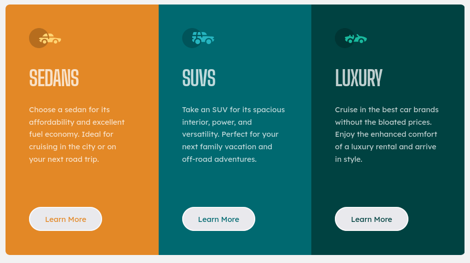
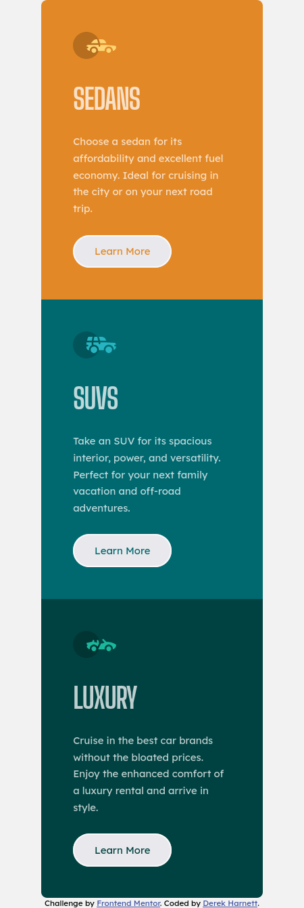

# Frontend Mentor - 3-column preview card component solution

This is a solution to the [3-column preview card component challenge on Frontend Mentor](https://www.frontendmentor.io/challenges/3column-preview-card-component-pH92eAR2-). Frontend Mentor challenges help you improve your coding skills by building realistic projects. 

## Table of contents

- [Overview](#overview)
  - [The challenge](#the-challenge)
  - [Screenshots](#screenshots)
  - [Links](#links)
- [My process](#my-process)
  - [Built with](#built-with)
  - [What I learned](#what-i-learned)
  - [Continued development](#continued-development)
  - [Useful resources](#useful-resources)
- [Author](#author)
- [Acknowledgments](#acknowledgments)

## Overview

### The challenge

Users should be able to:

- View the optimal layout depending on their device's screen size. TThere are desktop and mobile layouts.
- See hover states for interactive elements.

### Screenshots

### Links

- Solution URL: [https://github.com/harnettd/3-column-preview-card](https://github.com/harnettd/3-column-preview-card)
- Live Site URL: [https://harnettd.github.io/3-column-preview-card/](https://harnettd.github.io/3-column-preview-card/)

## My process

### Built with

- HTML5
- CSS
- Flexbox
- Sass
- BEM

### What I learned

I completed this project mainly to practice techniques I've learned working on previous projects. Also, I took the opportunity to implement some tips and tricks that I picked up from feedback on Frontend Mentor. Namely,

- I used the CSS trick `html {font-size: 66.7%}` to set `10rem` to `15px`.
- I set the card's width using `max-width: 100vw`. This is the first time I've used `vw` units.
- I set the preview card's height using `min-height: 100vh`. This is the first time I've used `vh` units.

### Continued development

Use this section to outline areas that you want to continue focusing on in future projects. These could be concepts you're still not completely comfortable with or techniques you found useful that you want to refine and perfect.

### Useful resources

- [Example resource 1](https://www.example.com) - This helped me for XYZ reason. I really liked this pattern and will use it going forward.
- [Example resource 2](https://www.example.com) - This is an amazing article which helped me finally understand XYZ. I'd recommend it to anyone still learning this concept.

## Author

- Github - [Derek Harnett](https://github.com/harnettd)
- Frontend Mentor - [@harnettd](https://www.frontendmentor.io/profile/harnettd)

## Acknowledgments

- Thanks to [Frontend Mentor](https://www.frontendmentor.io/) for posting this challenge.
